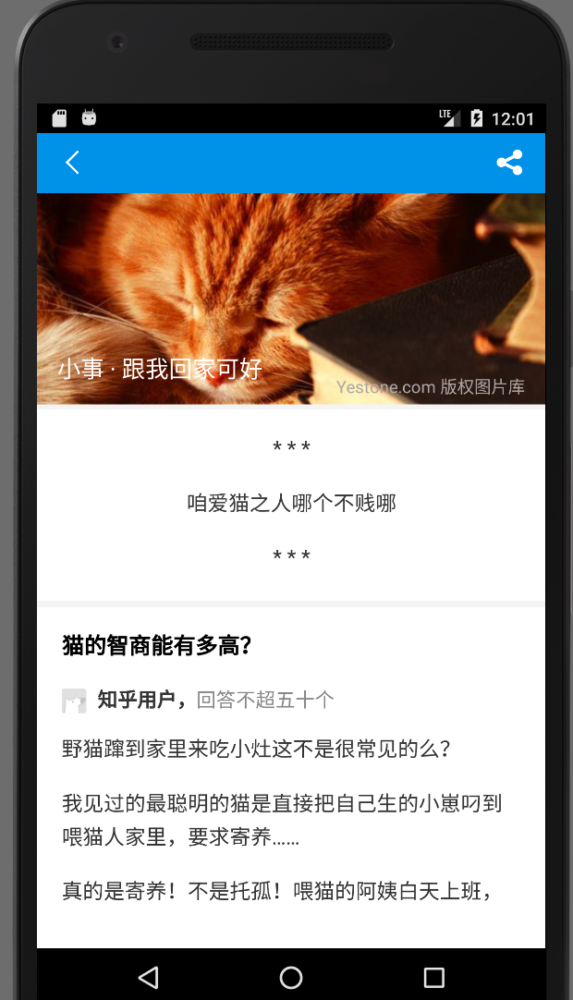

前言：一直对于能够使用vue进行跨平台的weex很好奇，但事实是局限性太强了，一个**嵌套滑动**都搞不定，一个自定义组件，官方文档都是错的，demo也是错的。。。最后和几个大兄弟一起探讨搞出来了，最后就当记录一下做了一个新闻项目

-------

-------

1.使用weexpack构建项目的，只做了android平台，事实是宣传的三个平台，但是基本上三个平台差异实在太大

2.weexpack run android  自己配置好weexpack环境吧

